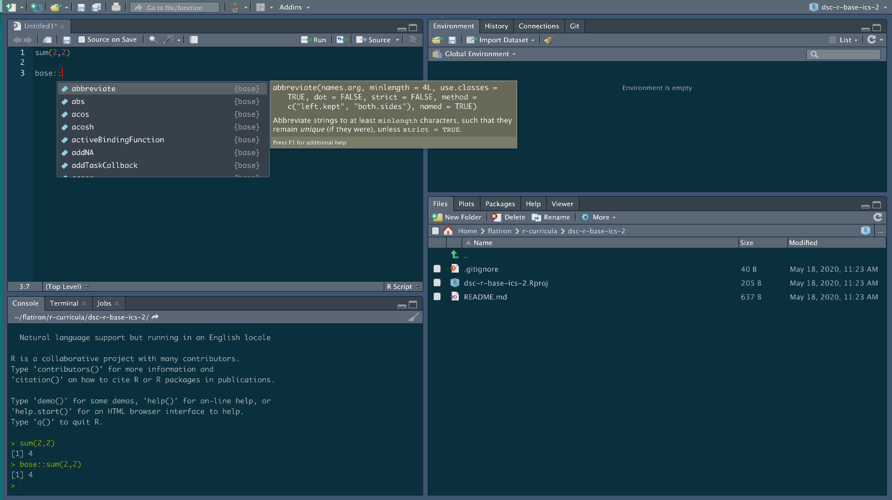
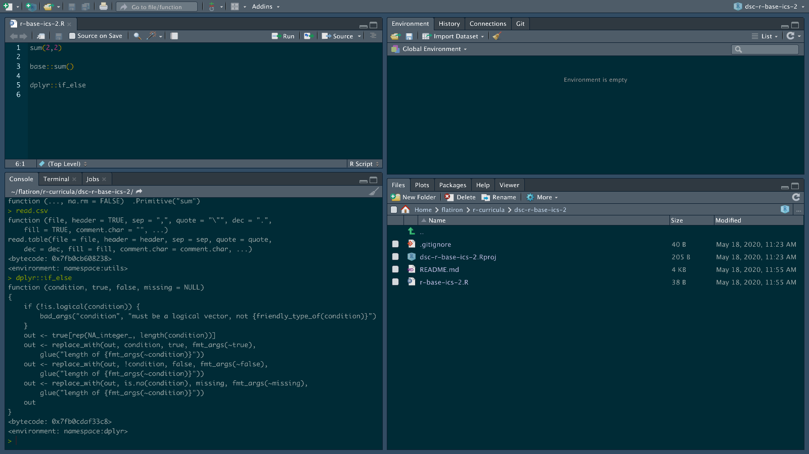

# Base R Basics II  

## To Do

* [ ] Edit Text
* [ ] Create Markdown Supp

In this lesson, we'll take a look at how to write functions in R and why R people tend to avoid writing loops. 

## Lesson Goals

By the end of this lesson, you will be able to: 
 

* [ ] Identify similarities and difference between functions in R and Python
* [ ] Identify the three main components of a function in R
* [ ] Explain what is vectorized code ?

## Functions

At this point you've probably written more than a couple of functions in Python.
You've had points in your analyses where there is no exact function to get the exact data and formatting you need, so you write your own functions in Python.
Here we look at functions in R.

Before writing our own functions, let's look at some similarities between R and Python functions that you might be comfortable with.

In the last lesson, we started with one of the most basic math operations we could think of which is adding `2 + 2`.

```{r}
2 + 2 
```

If you just looked at the code above, you actually could run that line in either R or Python since it's just basic math.
In Python, if we wanted to do this using something a bit more sophisticated, we could use the `.add()` method from `numpy`.

```{python}
import numpy as np

np.add(2,2)
```

Now since R is designed to deal with data first and foremost, the normal way to do this in R doesn't require grabbing an external package.

```{r}
sum(2,2) 
```

Notice here that we don't really have to specify what package sum is coming from.
Now it's not just coming out of thin air.
Behind the scenes R's `sum()` function here is coming from R's base package.
We could re-write the above as:

```{r}
base::sum(2,2) 
```

In order to be more explicit about where the function is coming from.
Now we won't get into the idea of environments and function masking here, for more reading on that check out [Advanced R?](http://adv-r.had.co.nz/Introduction.html). 
But we wanted to show how R can kind of look like Python.

Now there are TONS of functions from R's `{base}` package that you can find by either typing:

```{r}
lsf("package:base")
```

Or can be a bit more casual and explore using RStudio's auto complete feature.
If you type out `base::` and letting RStudio's auto complete to do the rest! 



Lastly, before moving on to writing our own functions, if you want to see the code underlying any function in R, you can always type it without the `()`.

For example, if we look at the `if_else()` function out of dplyr by just running:

```{r}
dplyr::if_else
```

Our output will look something like this:



One fantastic way to to learn a lot about any language when starting out is to try to spend a lot of time reading it before committing to writing it (just like learning a new spoken language!).

## Writing Our Own Functions

As listed in [Hands on Programming with R](), functions in R have three basic parts:

* Name
* The Body of Code
* Set of Arguments 

and take the general form of 

```{r}
my_new_r_function <- function() {} 
```

Now since you probably know a bit about functions in Python, let's jump straight to looking at a function in R and try to find similarities and differences!
Let's imagine you're planning an European holiday and need to practice understanding what temperatures mean in Celsius so you write yourself a program to convert your Fahrenheit temperature to what you'll read on your trip.

```{r}
convert_f_to_c <- function(farh_number) {
	celc <- (farh_number - 32) / 1.8
	celc
	}
```

On the left of the assignment operator we have the function name, in this case it's `convert_f_to_c`.
Our argument here is `x`, which is going to be our temperature in Fahrenheit.
After declaring what arguments we're going to put into our function inside the `( )` parenthesis, we then write our function body between the `{ }`.
The code here could almost be Python with the exception of the `<-` operator! 

In order to get better at writing functions in R, one thing to do would just be to keep things easy and try to convert some of your favorite functions from Python to R.

## Conclusions 

* More here 

